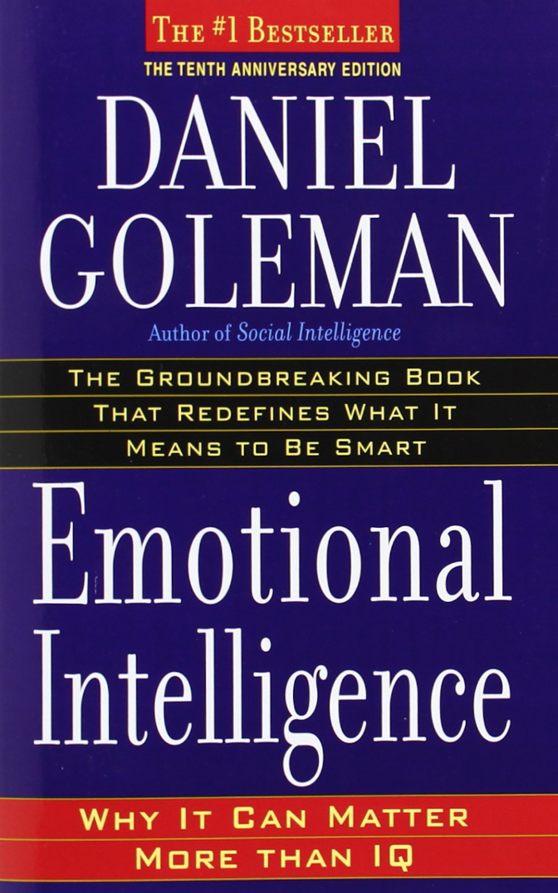

## Emotional Intelligence

#HSLIDE

### People with average IQs outperform those with the highest IQs 70% of the time

#HSLIDE

### Salovey and Mayer's Emotionally Intelligent People

 * They were good at understanding their own emotions
 * They were good at managing their emotions
 * They were empathetic to the emotional drives of other people
 * They were good at handling other people's emotions

#HSLIDE

#HSLIDE

 
#HSLIDE 
 

#HSLIDE

### Team Velocity

#HSLIDE

### Team Velocity

 
    
#HSLIDE

### What helped us

 * Group knowledge
 * Working incrementally
 * Rotating pairs
 * Team commitment to best practices
 * PM support

#HSLIDE

### What we can do?

#HSLIDE

### What we can do?

 * Out of the box Concourse configuration
