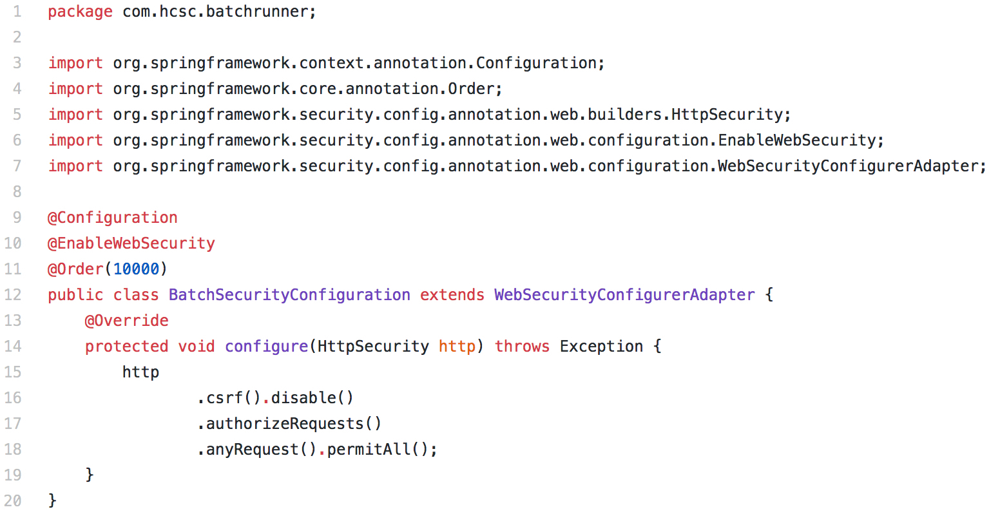

## MPIH and UPP and TIM soon to be MCP/MI

 * Tiffany Larson: 🦋
 * Scott Wendt: 🦋
 * Nick Dorans: 🦋
 * Portia Woodhouse: 🐻
 * James Artz: 🐻
 * Vivek Iyer: 🐢
 * Alissa Calomino: 🐅

#HSLIDE

## Spring Upgrade: Removing Spring Security 

#HSLIDE

## Issues we were seeing:
 1. Login page when running locally 
 2. Batch processing had strange errors ("no node")
    - SftpOutboundGateway: provides a limited set of commands that let you interact with a remote SFTP server (e.g. ls, get, put)
    - No indication it was related to Spring Security
    

#HSLIDE

#HSLIDE

## Why even use Spring Security?

 - Purpose is to provide authentication and authorization
 - We were overriding all Spring Security defaults for our own custom authentication flow
 - We were only using it to parse a JWT
 - Lots of changes in Spring Security for 2.0 upgrade
 
#HSLIDE

### Existing Authentication Flow

#HSLIDE

#### New Authentication Flow: Authentication Configuration

#HSLIDE

##### New Authentication Flow: JwtConfiguration
 

