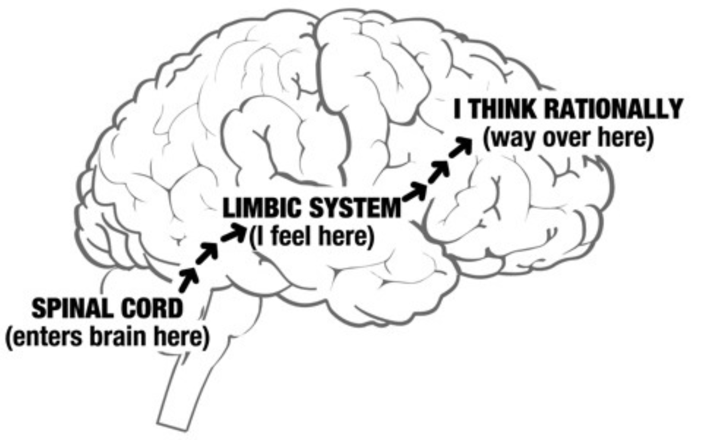

## Emotional Intelligence

#HSLIDE

### People with average IQs outperform those with the highest IQs 70% of the time

#HSLIDE

### Salovey and Mayer's Emotionally Intelligent People

 * They were good at understanding their own emotions
 * They were good at managing their emotions
 * They were empathetic to the emotional drives of other people
 * They were good at handling other people's emotions

#HSLIDE

#HSLIDE

 
#HSLIDE 

### EQ Definition: The ability to identify and manage your own emotions and the emotions of others

#HSLIDE

### Why is it important?

 * EQ is responsible for 58% of your job performance
 * 90% of high performers have high EQ
 * People with high EQ make $29,000 more annually than their low EQ counterparts 
 * The link between EQ and earnings is so direct that every point increase (in all industries, at all levels, in every region of the world) **adds to $1,300 to an annual salary**

#HSLIDE

|                    |  What I see    |   What I do  |
|---                 |             ---|           ---|
|Personal Competence |  Self Awareness *(understanding yourself)* | Self Management *(managing your behavior)*|
                        
|Social Awareness    |                |              |