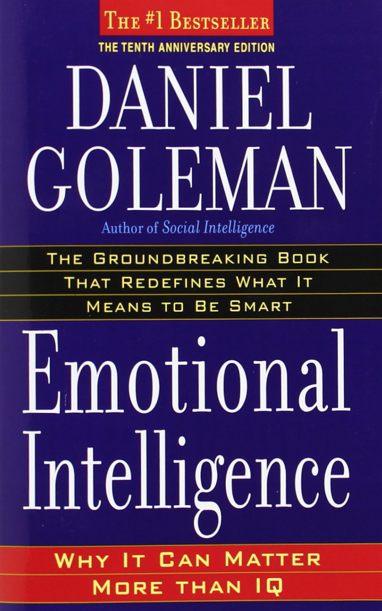

## Emotional Intelligence

#HSLIDE

### People with average IQs outperform those with the highest IQs 70% of the time

#HSLIDE

### Salovey and Mayer's Emotionally Intelligent People

 * They were good at understanding their own emotions
 * They were good at managing their emotions
 * They were empathetic to the emotional drives of other people
 * They were good at handling other people's emotions

#HSLIDE

#HSLIDE

 
#HSLIDE 

### EQ Definition: The ability to identify and manage your own emotions and the emotions of others

#HSLIDE

### Why is it important?

 * EQ is responsible for 58% of your job performance
 * 90% of high performers have high EQ
 * People with high EQ make $29,000 more annually than their low EQ counterparts 
 * The link between EQ and earnings is so direct that every point increase (in all industries, at all levels, in every region of the world) **adds to $1,300 to an annual salary**

#HSLIDE

|                    |  What I see    |   What I do  |
|---                 |             :---: |           :---:|
|Personal Competence |  **Self Awareness** *(understanding yourself)* | **Self Management** *(managing your behavior)*|
|Social Awareness    |  **Social Awareness** *(understanding other people)* | **Relationship Management** *(managing intercommunications)*|

#HSLIDE

## Self Awareness

#### Your ability to accurately perceive your own emotions in the moment and understand your tendencies across situations

#HSLIDE

#### What you might have heard...

 1. When things are going well for Miss Vanjie, she brings really strong skill to the team. However, when things don't go her way she is very difficult to communicate with. She needs to learn to recognize her triggers so she can respond more effectively.
 2. Miss Vanjie needs to become aware of how she is perceived. She can come across as very demanding.
 3. Miss Vangie is very passionate about what she does. When she gets excited, she talks over people and doesn't listen to others. 

#HSLIDE

#### Strategies to improve

 1. Don't treat feelings as good or bad
 2. Know who and what pushes your buttons
 3. Feel your emotions physically
 
#HSLIDE

|                    |  What I see    |   What I do  |
|---                 |             :---: |           :---:|
|Personal Competence |  **Self Awareness** *(understanding yourself)* | **Self Management** *(managing your behavior)*|
|Social Awareness    |  **Social Awareness** *(understanding other people)* | **Relationship Management** *(managing intercommunications)*|

#HSLIDE

## Self Management

#### Your ability to use your awareness of your emotions to stay flexible and direct your behavior positively

#HSLIDE

#### What you might have heard...

 1. In stressful situations, Miss Vanjie responds too quickly, sharply, or disjointedly.
 2. Miss Vanjie needs to be so honest. If certain things upset her, she needs to learn to keep them to herself.
 3. Miss Vangie needs to be less reactive. In times of crisis, she shouldn't reveal to everyone how stressed she is. 

#HSLIDE

#### Strategies to improve

 1. Create goals and make them public
 2. Breathe, count to ten, count to whatever, or better yet....just sleep on it
 3. Think of things for which you are grateful

#HSLIDE

|                    |  What I see    |   What I do  |
|---                 |             :---: |           :---:|
|Personal Competence |  **Self Awareness** *(understanding yourself)* | **Self Management** *(managing your behavior)*|
|Social Awareness    |  **Social Awareness** *(understanding other people)* | **Relationship Management** *(managing intercommunications)*|

#HSLIDE

## Social Awareness

#### Your ability to accurately pick up on emotions in other people and understand what is really going on with them

#HSLIDE

|                    |  What I see    |   What I do  |
|---                 |             :---: |           :---:|
|Personal Competence |  **Self Awareness** *(understanding yourself)* | **Self Management** *(managing your behavior)*|
|Social Awareness    |  **Social Awareness** *(understanding other people)* | **Relationship Management** *(managing intercommunications)*|

#HSLIDE

## Relationship Management

#### Your ability to use your awareness of your own emotions and those of others to manage interactions successfully
