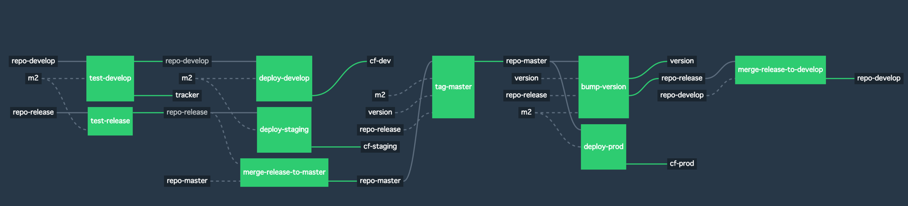
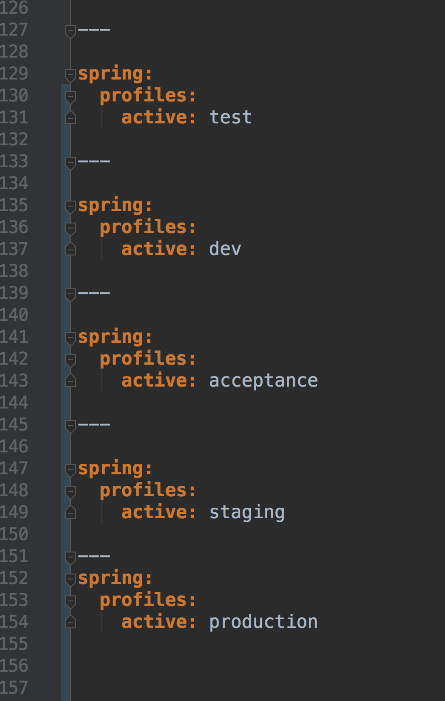
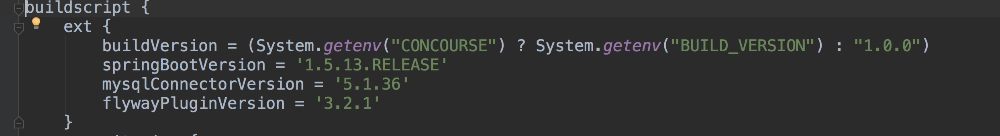
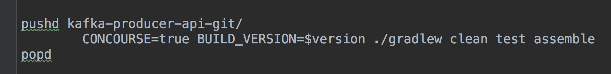

## Concourse and Kafka 

#HSLIDE

### Why we chose to create a microservice

 * Opportunity to separate out logic
 * Current app is overloaded
 * Difficult to view logs in existing app
 * Challenges of working with new tech
 * Reusability

#HSLIDE

### What hurt us

 * Creating a repository
 * Unfamiliarity with concourse
 * Not using an in memory database
 * Yaml merge conflicts

#HSLIDE

#HSLIDE

# Gradle Gotcha's

 * Gradle contains a highly sophisticated dependency caching mechanism, which seeks to minimise the number of remote requests made in dependency resolution
 
#HSLIDE 
 

#HSLIDE

### Team Velocity

#HSLIDE

### Team Velocity

 
    
#HSLIDE

### What helped us

 * Group knowledge
 * Working incrementally
 * Rotating pairs
 * Team commitment to best practices
 * PM support

#HSLIDE

### What we can do?
