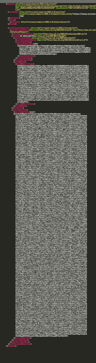
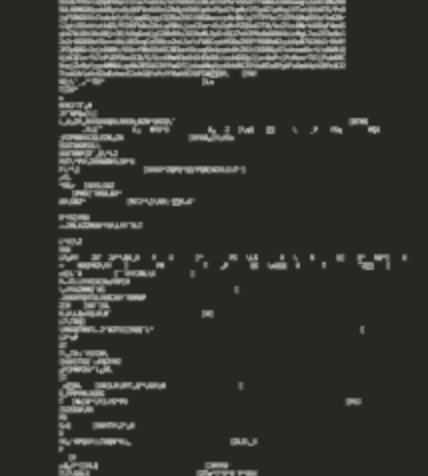

## MPIH

 * Tiffany Larson - Butterfly
 * Scott Wendt - Butterfly
 * Portia Woodhouse - Bear
 * James Artz - Bear
 * Anbu Thamizh Thendral - Turtle
 * Vivek Iyer - Turtle
 * Kyle Norris - Crocodile
 * Alissa Calomino - Tiger

#HSLIDE

## Siteminder

#HSLIDE

### What is it 

 * SSO integration for internal and external
 * I know who you say you are
 * Redirecting    
 
#HSLIDE

### How it's set up

 * Partnership v application

#HSLIDE

### Application

 * Internal (not ldap enabled)
 * Two apps don't have the same concept of a user

#HSLIDE

### Partnership

 * External
 * I know the person but you don't
 * Github authentication, facebook authentication, etc

#HSLIDE

### How does MPIH use it

 1. Bam sends get request with cookie to Siteminder with SPID
 2. Siteminder validates cookie then encrypts and encodes it 
 3. Javascript redirect with self submitting form with SAMLResponse
 4. MPIH decodes SAMLResponse 
 5. MPIH decrypts SAMLResponse

#HSLIDE

### Issues we've had

#HSLIDE

#HSLIDE

#HSLIDE

#HSLIDE

#HSLIDE

#HSLIDE

